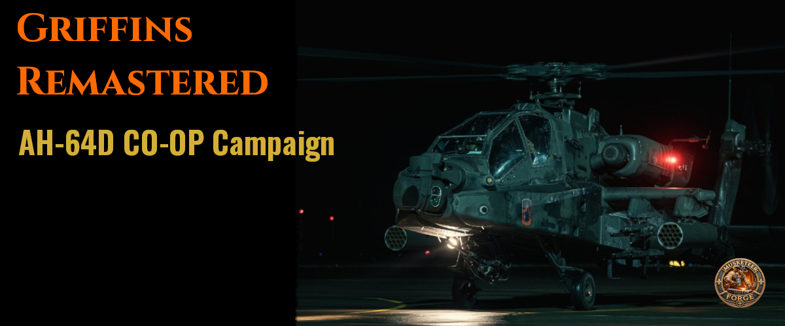

# Griffin's Remastered

**A 10-mission DCS AH-64D cooperative campaign for the Persian Gulf**

*Multiplayer focused • Solo capable • Fully voiced • Story driven*

---

## About the Campaign

In May 2022, **Dagobert666** released the original *Griffins* multiplayer Apache campaign. It was an exceptional piece of cooperative DCS content.

After our group completed it, we kept talking about the missions. Several had become some of our most memorable DCS experiences, and that is saying something for a group that has been flying combat simulators since the *Flanker* days.

As our resident mission builder, I eventually decided to revisit the campaign. Before touching it, I contacted Dagobert666 and asked for permission to rework his creation. He was completely supportive of the idea.

What began as an effort to replace some voiceovers grew into something much larger.

**Griffin's Remastered** preserves the foundation and mission concepts of Dagobert666's original campaign while building a new experience around them. The ten missions are connected by a completely new campaign narrative, supported by a fully voiced radio environment and extensive revisions to the underlying missions.

This remains, first and foremost, Dagobert666's creation. Griffin's Remastered exists because he generously allowed me to take his work apart, understand it, rebuild portions of it, and put it back together in a different form.

---

## What's Different in the Remaster?

The fundamental themes and objectives of most missions remain faithful to the original campaign, but a great deal changed underneath and around them.

### A New Campaign Story

All ten missions are now connected by a larger narrative rather than functioning simply as a collection of individual scenarios.

Mission events and outcomes can produce different radio dialogue, allowing the story and characters to respond to what happens during the mission.

### Fully Voiced

The campaign features a completely rebuilt radio environment using AI-generated character voices.

Every line was first performed and recorded by the campaign developer and then transformed into the different characters heard throughout the campaign.

The result is a much richer radio environment designed to make the player feel like part of an ongoing military operation rather than simply moving from one Mission Editor objective to another.

### Reworked Missions

Several missions were substantially refactored, and some were rewritten.

Randomization and alternate behaviors were added where appropriate to improve replayability, although the original campaign already contained a considerable amount of variation.

Mission 05, **Moonlight**, received the most extensive treatment. While its fundamental objective remains rooted in the original design, the mission was rebuilt in a new location to create the dark nighttime environment the scenario deserved.

### Rebuilt Mission Logic

Much of the original trigger architecture was rewritten.

Numeric flags were replaced with descriptive variables, mission logic was reorganized, and Mission Editor comment blocks were added throughout the missions. This made the campaign easier to understand, debug, maintain, and extend while preserving the intent of the original mission design.

---

## Designed for Cooperative DCS

Griffin's Remastered was built around **multiplayer cooperation**.

This is not simply a set of missions that happen to permit multiple client aircraft. The experience is at its best when Apache crews work together: coordinating attacks, dividing responsibilities, communicating threats, and adapting when the plan inevitably encounters the enemy.

Radio-menu interactions are shared at the mission level. When a mission requires a player response, only one player needs to make the radio call; the mission then advances for everyone.

The campaign has been flown repeatedly by multiple multiplayer groups, including Dagobert666's own crew.

---

## Solo Play

Although multiplayer is the primary experience, **the entire campaign can be played solo**.

Most missions scale according to the number of participating players, and all ten missions were tested in solo play during development.

Some scenarios will naturally be considerably more difficult alone. The campaign was designed around cooperative Apache operations, so a solo pilot may occasionally find himself doing the work originally intended for several aircraft.

No Mission Editor conversion is required simply to play the campaign solo.

---

## Backup Aircraft

Some missions cover significant distances. In the original campaign, losing an aircraft could effectively remove a multiplayer pilot from the remainder of the mission because the available replacement aircraft might be far from the action.

Griffin's Remastered introduces **hot-start backup Apaches** in missions where this problem was particularly significant.

These aircraft allow a downed player to rejoin the fight more quickly.

There is one important limitation: the original mission trigger architecture was not completely redesigned around replacement aircraft. If every player is killed and everyone subsequently occupies backup aircraft, some later voiceover or mission-ending triggers may not behave as intended.

---

## Missions

| Mission | Title          | Version |
| ------- | -------------- | ------: |
| M00     | Mayflower      |     1.0 |
| M01     | Snake Run      |     1.0 |
| M02     | Broken Wing    |     1.0 |
| M03     | Slaughterhouse |     1.0 |
| M04     | Steeplechase   |     1.1 |
| M05     | Moonlight      |     1.2 |
| M06     | Rabbit Jump    |     1.1 |
| M07     | Seraphim       |     1.1 |
| M08     | Playboy        |     1.1 |
| M09     | Daggerfall     |     1.1 |

Each mission includes a separate briefing PDF.

Mission filenames remain stable between releases. Mission versions are tracked independently and are recorded within the first trigger comment of each mission.

---

## Downloads

Campaign builds are distributed through **GitHub Releases**.

### Full Campaign

For a new installation, go to the **[latest GitHub Release](https://github.com/MusketeerForge/Griffins-Remastered/releases/latest)** and download:

**`Griffins_Remastered_Full.zip`**

This contains the complete current campaign, including all ten missions and their briefing PDFs.

### Individual Missions

Every mission is also packaged separately:

**`Griffins_M00.zip`** through **`Griffins_M09.zip`**

Each individual package contains:

- The mission `.miz`
- The corresponding briefing PDF

Individual packages provide a lower-bandwidth installation option and allow existing players to download only missions that have changed rather than downloading the complete campaign again.

Players with limited or metered bandwidth can also install the campaign incrementally by downloading individual mission packages rather than the complete campaign at once.

---

## Content Warning

The original *Griffins* campaign contained colorful military language.

The remaster continues that tradition.

**This campaign contains frequent adult language throughout its ten missions.** Players who prefer a sanitized radio environment should consider this before downloading.

---

## Credits

### Original Campaign

**Dagobert666**

*Griffin's Remastered* would not exist without Dagobert666's original campaign or his generous permission to rework it.

His mission concepts, creativity, and cooperative design form the foundation upon which the remaster was built. When approached about revisiting the campaign, he gave us the freedom to take it apart, rebuild it, and carry it in a new direction while preserving what made the original special.

### Griffin's Remastered

**Kandy / Mistermann • Zipper / Wulf103 • Mongo / Devil505**

The remaster was built around the three pilots who flew it together.

Kandy led the Mission Editor work, campaign narrative, trigger refactoring, voice production, briefing development, and technical implementation. But *Griffin's Remastered* was never developed in isolation.

Zipper and Mongo were part of the campaign throughout its development. They flew the missions repeatedly as they were rebuilt, evaluated changes in actual cooperative play, found problems that could only emerge when several human pilots attacked a mission from different directions, and helped determine what worked and what did not. Their feedback influenced mission balance, pacing, radio interactions, gameplay, and the overall character of the remaster.

Many of the changes that ultimately defined *Griffin's Remastered* came from those flights: a mission would be rebuilt, the three of us would fly it, we would discuss what happened, and it would go back into the Mission Editor. Sometimes that process happened more than once. What emerged was shaped as much by flying the campaign together as by building it.

The names **Wulf103** and **Devil505** also appear in the original DCS forum discussion. Those are Zipper and Mongo respectively—the same pilots who helped develop and validate the remaster from beginning to end.

This was our campaign.

### Additional Testing and Feedback

Special thanks to **Dagobert666 and his crew**, who returned to the remastered campaign and put it through their own multiplayer testing.

Their perspective was particularly valuable: they knew the original campaign better than anyone and could evaluate not only whether the remaster worked, but whether the changes respected the experience upon which it was built.

And thank you to everyone who has downloaded, flown, discussed, and provided feedback on *Griffin's Remastered* since its original release.

## History

Griffin's Remastered was originally released through the DCS User Files system beginning in June 2024, with the complete ten-mission campaign released over the following weeks.

The campaign is now maintained and distributed by **Musketeer Forge** through GitHub.

The move to GitHub provides a permanent version history and allows campaign releases to support both complete downloads and bandwidth-conscious individual mission updates.

---

**Musketeer Forge**

*Experiences Worth Earning.*
